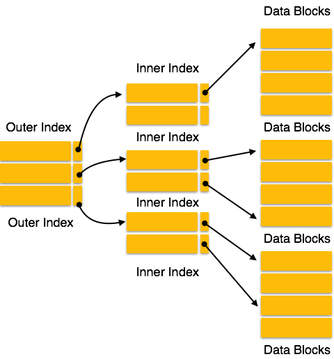

# Some Interview Questions
Nothing is in the order 😉

1. **Tell me about yourself**
    > It generally is asked to get a brief, concise walkthrough of your career story with some relevant experience.  
        Depending on what you said interviewer will form next questions.

    Sure! So I've always wondered about technology and want to learn about how those things works. I opt for pursuing carrer in Programming dispite of not being in cirtuital branch. I started nurturing my knowledge in this field after Second Semester. At that time like a noobs I use to jump from one techonology to other that continues for almost about one semester after that I decided that I'm pretty good in web development and Deep Learning. so after that I narrow down my path of learning and started brushing up my concept of web development and deep learning, I started expoloring frameworks like react and django in depth and learned tensorflow and studied mathematics behind machine learning algorithms. As result of knowledge acquired I was able to Crack Google Summer of Code and at same time secured a foriegn internship in Computer Science department of University of Tokyo where I worked on investigation of deep learning methods for cancerous and non cancerous cell determination and also contributed in the development of Web Server for Cromatin Structure Visualization that was powered by django and threejs, in the mean time I was also been able to complete my GSoC project which was a React App application for Deep Learning Model architecture building via drag and drop interface. After returing to the campus I started my journey of compititive programming at that time I don't have any idea what the hack CP is I just herd the name and known that is very much important in getting good job. I learned a lot about Data Structure and Algorithms and used to solve problem peice by piece I gained a good plinth of Internel of any programs previously that is just called from a library and used.

2. **Explain Any of your project that you thing we need to know**
    > Team work, Approch to the problem, etc

    I did various projects, which are mainly centered around web development and machine learning combine, but the project that I want to share is a collaborated applied research project of BioTech Department IIT Roorkee and AIIMS Delhi under a professor and a research Scholar, The project was to developed a some piece of software to analyse and determine Human Heart state.Previously they have a android mobile app that uses weight, heart rate, and blood pressure as sequencial data to determine that heart state, and the professor want some mote automation and intellegince in the app and want to make it cross platform. So, After joining, first thing that I did in that project was the migration of codebase from android to react-native to make it cross platform. while I was developing that Application I used to read research article related to the ECG and Deep learning and what is the status of ECG research. After discussing with the Ph.D student and professor I proposed a method that integrate heart beat tagging using paper ECG records and an input. Which was done in series as the task was very tedious because of the variablity in ECG record layout, noisy and overlaping Heart Beats. Variable of Record was tackled by choosing three widely used format(suggested by AIIMS cardiology department) and identifing it via Simple Image classifier which was trained on three class images manually collected from the internet. After layout identification, heart-beats are segmented using the strategy of object detection and QRS interval determination, after that segmented beats are passed onto the final beats tagger which is a attention based multi input convolutional neural network trained over 14 different heart beat states. we are corrently budling up the thing to make it accesable via mobile app and also create a React Web app for bulk image tagging.

3. **Tell me about how your previous rounds went**
    > wants to ask where to performed well are where worst

4. **Time Complexity Analysis Question**
    > A piece of code is given determine it time and space complexity.

5.  **ACID property of DBMS**

6.  **SQL Queries mainly join and nested**

7.  **How the C Program runs**

8.  **I/O operations in C/C++**

9.  **What are System Calls**

10. **What is Storage Class**

11. **What are General Purpose Registers**

12. **What is Linker**

13. **what is loader**

14. **What is IPC(Inter Process communication) and pipes**

15. **What is the difference between c and c++**

16. **List and Explain some OOPs Concept and explain their requirement and importance**
    *   **What is class**
    *   **What is inheritance**
        Inheritence is a property of class by which it can inherit some property from the other class called its parent class.
        * Sub Class
        * Super Class
        ```c
        class Parent{
            public:
                // functions
        }
        class Child : <access mode> Parent{
            public:
                // functions
        }
        ```
        * Access mode
        **private**, **public**, **protected**(default is private)
        ```c
        class A{ 
            public: 
                int x; 
            protected: 
                int y; 
            private: 
                int z; 
        }; 
            
        class B : public A { 
            // x is public 
            // y is protected 
            // z is not accessible from B 
        }; 
        
        class C : protected A { 
            // x is protected 
            // y is protected 
            // z is not accessible from C 
        }; 
        
        class D : private A { 
            // x is private 
            // y is private 
            // z is not accessible from D 
        };  
        ```
        * **Types of Inheritence**
            * Single Inheritence
            * Multiple Inheritence
            * Multilevel Inhertitence
            * Hierarchical Inheritence
            * Hybrid (Virtual) Inheritence
    *   **What is object**
    *   **What is Abstraction**
    *   **What is Encapsulation**
    *   **What is Polymorphism**
    *   **What is Overloading**
    *   **Explain Exception Handling**

17. **What are Virtual functions and virtual classes?and why they are used**
    *   **How inheritence affected by the virtual and pure virtual function**

18. **What is normalization in DBMS**
    *   **4 different methods of normalization**
    *   **Give example table for every method**

19. **Name mangling and extern**

20. **What are Smart Pointers**

21. **What are constructors and destructors**
    Constructor in cpp is a special member function of the class having same name as class and no return type, which will be called every time when the object is create.
    * More than one constructor in a class is called a ***constructor overloading***.
    * **Copy Constructor:** A copy constructor is a member function which initializes an object using another object of the same class.
        * **Shallow Copy vs Deep Copy**
        Default cpp constructor do shallow copy(memory location pointer refrence changing one will effect other), if you want to perform deep copy(Complete memory copy) implement your own copy constructor.

22. **What are namespaces and their use**

23. **Static keyword in C++? Does it exist in C?**

24. **free in C and what is its use**

25. **Compile time polymorphism and run time polymorphism**

26. **Data Structure Implementation for particular type of problem**
    *   **To store browser History**
    *   **To store student info like id, grade, etc**
    *   **Recyling bin implementation**
    
27. **What is error 404, 401, 502, etc**

28. **How http, DNS, https works?**

29. **Web page Network Diagnosis and Profiling**

30. **RSA encryption algorithm**

31. **Difference between static and global variable**

32. **Adavantages of linux over windows and why developers prefer that?**

33. **Static vs Dynamic linking**

34. **What happened when you type google.com**

35. **How message send in each layer from your PC to the router and so on till the message reaches to the servers of google.**

36. **Protocols? ARP, RARP, BOOTP, DHCP, etc ?compare UDP and TCP?**

37. **Orpan vs Zombie process**

38. **Difference between thread and Process**

39. **What is routing in computer networks**

40. **Types of Memory Available**
    There are four types of memory available:
    *   Computer Registers (ICs)
    *   Cache Memory(ICs)
    *   Main Memory(RAM)
    *   Secondary Memory(Hard Drive, Solid State Drive)

41. **Explain CPU Scheduling**

42. **Explain Deadlock**

43. **Paging and segmentation**

44. **What is SuperNetting and SubNetting**

45. **Fragmentation in IP packets**

46. **Explain TTL**

47. **Difference between IPv4 and IPv6**

48. **Difference between SQL and noSQL database with example**

49. **Ternary Search is Inefficient than Binary Search. Why??**
50. **What are B and B++ Tree and there significance in databases**
    * **Disk Structure**
        <center>

        

        </center>

        * Any location on the disk can be accesside using track Number $\rightarrow$ Sector Number $\rightarrow$ Block Number.
        * Offset is also required in addition to the above numbers to get exact data.
    * **Usefulness of indexing and multi-indexing**
        <center>

        
        
        </center>
    * **m-way Trees**
    * **Condition Imposed on m-way trees to make them B Trees**
    * **Condtion Imposed on B trees to make them B+ Trees**

51. **Continuous Integration(CI) in CPP**
    CI is automatic building of project and running of the test cases in either on your local machine or any cloud machine so that every time code repository gets new commit it re-run that whole pipeline imediately.
    Using ***Jenkins***: Create Jenkinsfile, Write command to build project, Run test cases and setup Jenkins server.